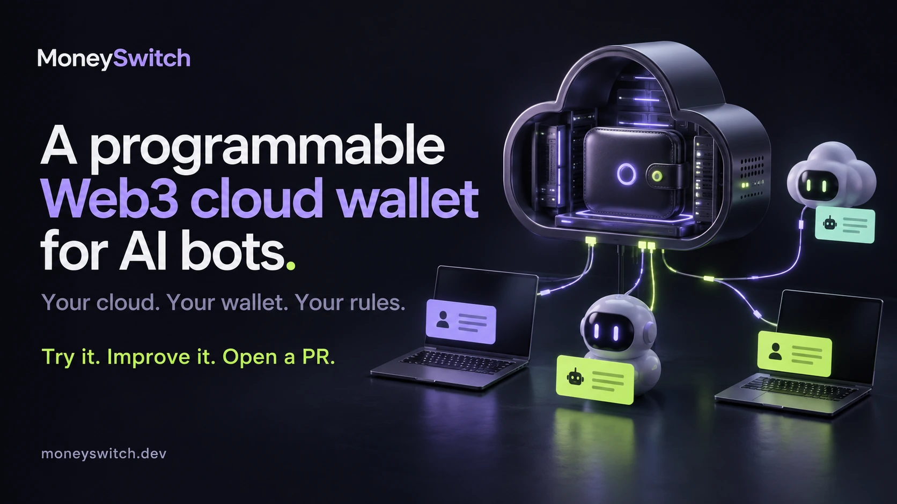
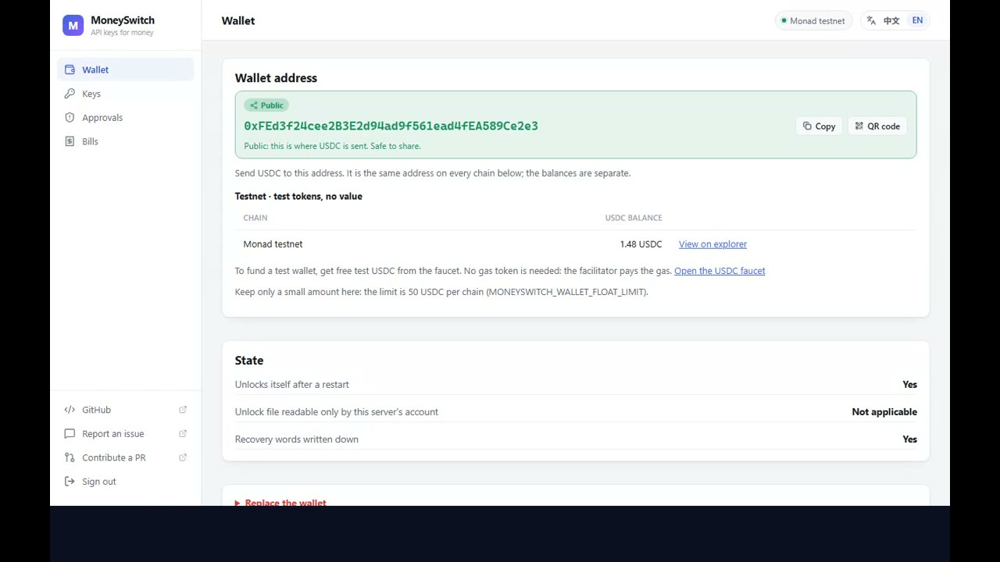
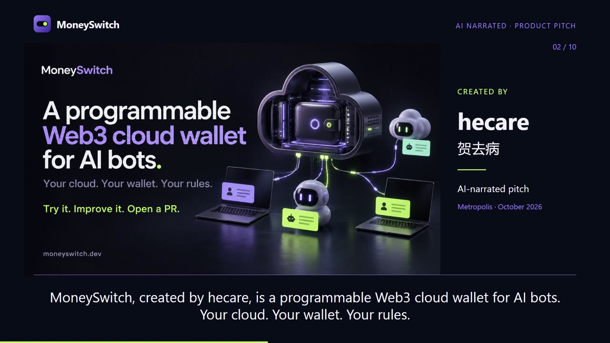
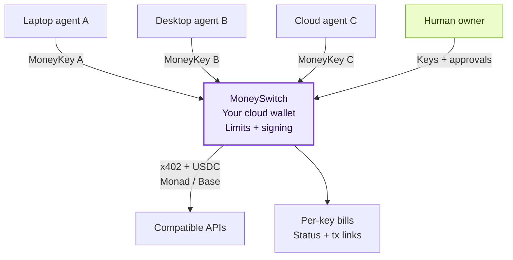
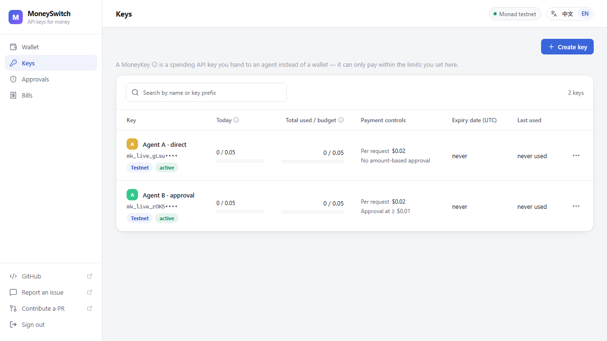
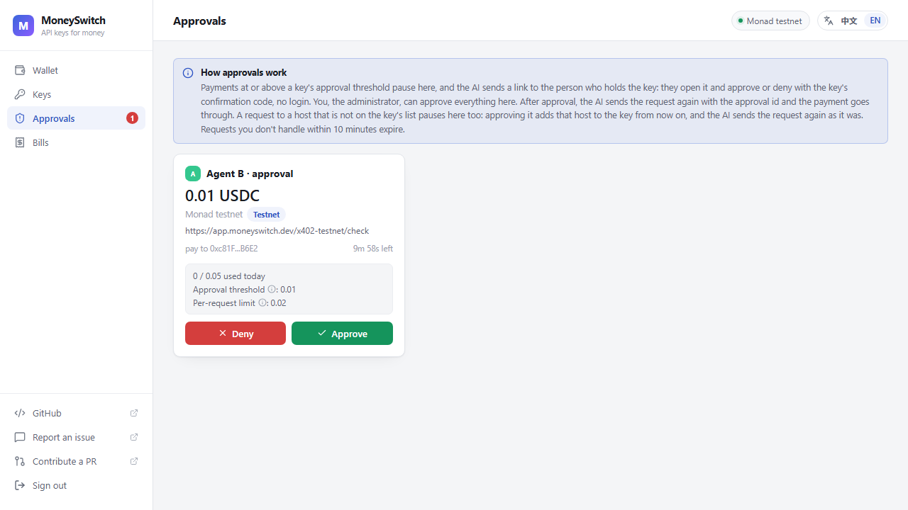
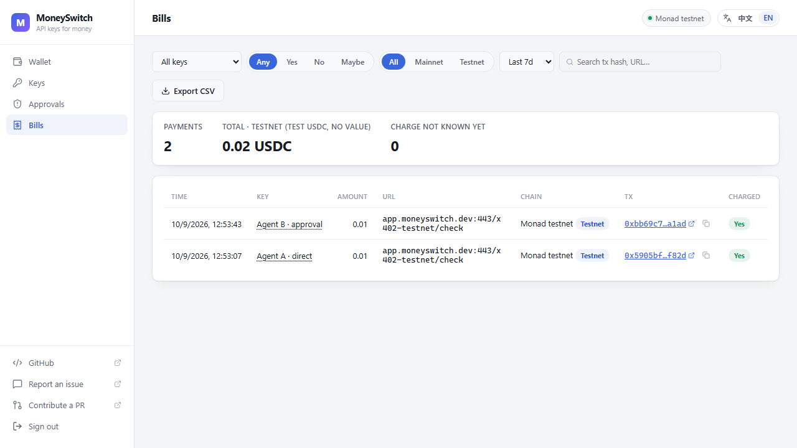

# MoneySwitch

**A programmable, self-hosted Web3 cloud wallet for AI bots.**

[Website](https://moneyswitch.dev) · [Watch the demo](https://moneyswitch.dev/videos/technical-demo/) · [Try it](https://moneyswitch.dev/pilot/) · [Contribute a PR](CONTRIBUTING.md#first-pr) · [中文](README.zh-CN.md)

[](https://moneyswitch.dev)

Your agents run across laptops, desktops and cloud servers. Give each one a **MoneyKey** with its own spending rules, connected to one wallet service on your own server. The AI calls an HTTP API; the wallet's private key stays on the server.

- **One key per agent:** daily, total and per-request limits, allowed hosts, expiry and revocation.
- **Human control:** payments at or above a configured approval threshold wait for approval; hard spending limits still apply.
- **Traceable payments:** per-key bills, payment outcomes and transaction links for compatible x402 services, using USDC on Monad or Base.

## Watch it work

Click either preview to watch in your browser. No sign-in is needed.

<table>
  <tr>
    <td width="50%">
      <a href="https://moneyswitch.dev/videos/technical-demo/"></a>
      <p><a href="https://moneyswitch.dev/videos/technical-demo/"><strong>▶ Product demo · 2:02</strong></a><br>Two MoneyKeys, a direct payment, a human-approved payment, transaction records and key revocation.</p>
    </td>
    <td width="50%">
      <a href="https://moneyswitch.dev/videos/pitch/"></a>
      <p><a href="https://moneyswitch.dev/videos/pitch/"><strong>▶ Why a cloud wallet? · 1:38</strong></a><br>The multi-device agent problem, the product and its creator, 贺去病 / hecare.</p>
    </td>
  </tr>
</table>

The product demo is a real Dashboard recording on **Monad testnet**, with two scripted HTTP clients making real testnet payments. Test USDC has no monetary value. Both videos have English narration and captions. [Video library](https://moneyswitch.dev/videos/) · [Download MP4s](https://github.com/dongsheng123132/moneyswitch/releases/tag/metropolis-videos-2026-10-09)

## How the cloud wallet fits together



The owner controls the deployment and funds. Agents receive spending keys, not wallet private keys. Keep the wallet service isolated from the agents' operating-system permissions; see the [self-hosting guide](deploy/README.zh-CN.md).

## Inside the Dashboard

Actual v0.7.6 screens from the October 9, 2026 testnet demo. Click a screenshot to inspect it at full size. The cover above is a concept illustration; the screens below are the running product.

**1. Give each agent its own budget and approval rules.**

[](docs/media/dashboard-keys.png)

**2. Review a payment that reaches its approval threshold.**

[](docs/media/dashboard-approval.png)

**3. See which agent paid, how much and the resulting transaction.**

[](docs/media/dashboard-bills.png)

## Try it, report it, open a PR

| Start here | What to do |
| --- | --- |
| [Testnet trial guide](https://moneyswitch.dev/pilot/) | Deploy your instance, issue a testnet key and make your first test payment. |
| [Send trial feedback](https://github.com/dongsheng123132/moneyswitch/issues/new?template=early-feedback.yml) | Tell us what you tried, what happened and what would make it useful. |
| [Make your first PR](CONTRIBUTING.md#first-pr) | Follow the fork → change → test → PR steps. Docs, integration instructions and focused fixes are welcome. |
| [Get articles, images and videos](https://moneyswitch.dev/media/) | Find the official media kit for sharing MoneySwitch. |

**One MoneySwitch spends for one payer.** You on your own machine, a company issuing keys to its staff's AIs, a company running its own bots: each is one payer, and every coin in the wallet belongs to whoever deployed the server. The administrator issues the keys; there is no sign-up and there are no user accounts.

[SPEC.md](SPEC.md) is the authoritative specification. Setup and payment details follow below.

## Run it

Node.js 22+ and pnpm.

```sh
pnpm install --frozen-lockfile
pnpm build
node apps/server-pkg/dist/cli.js --data-dir ./data
```

The first start prints an administrator token and a one-time sign-in link (valid 30 minutes, single use). Open the link: it signs you in and lands on the Wallet page. Set `MONEYSWITCH_PUBLIC_URL` to the address people will reach the server at; approval links and the skill text use it (without it they name the server's own listen address, `http://127.0.0.1:4020` by default, never a request's `Host` header). Lost the administrator token? On the server itself, as the user that runs it: `moneyswitch-server reset-admin-token` (Docker: `docker compose exec server node /app/dist/cli.js reset-admin-token`; from source: `pnpm admin:reset-token -- --data-dir <dir>`); see [docs/security.md](docs/security.md).

The Dashboard has four pages and a login:

| Page | What you do |
|---|---|
| **Wallet** | Create the wallet. Write down the 12 words (shown once) and tick "I wrote them down". Send it a little USDC. It unlocks itself after a restart. Balances come in two groups, "Mainnet · real money" and "Testnet · test tokens, no value" (only the kinds you enable), each with its own funding note. |
| **Keys** | Issue one key per AI. First choose its network type: **testnet** (test tokens, no value) or **mainnet** (real USDC: you must tick "this key spends real money"). A testnet key pays only on testnets and a mainnet key only on mainnets, never both. Then the daily, total and per-request limits, allowed hosts, approval line, expiry. The key and its skill paragraph (which says which type it is) are shown once; paste the paragraph into the AI. Every root key also gets a **confirmation code** for the person who will use it: 4 to 6 digits that you type (their own choice, if you like), or a random 4-digit one when you leave it empty. It is shown once, next to the key, and is never in the skill paragraph: it is for a person, not for the AI. "Set confirmation code" on a key's row replaces it at any time (and unlocks it); resetting the key's secret leaves it alone. A key issued before v0.7.4 has none until you set one, and the list says so ("No confirmation code · only the administrator can approve"). Limits and network type are fixed once a key is issued: to change them, revoke the key and issue a new one. The allowed hosts can only be widened, by approving a new host (below). The list marks every key Testnet or Mainnet; a key issued before v0.7.2 shows "Legacy key" with the chains it really pays on (see the Networks section; revoking it and issuing a new one is recommended). |
| **Approvals** | Approve or deny a payment that is over a key's approval line, or a request to a host that is not on a key's list: approving a new host adds it to that key's allowed hosts. You, the administrator, see and decide everything here. The person who holds a key does not need to sign in: the approval link opens for them, shows that one request, and the key's confirmation code approves or denies it. |
| **Bills** | Every payment: time, key, amount, URL, chain (marked mainnet or testnet), transaction hash, charged yes / no / maybe. The totals are one per kind, mainnet and testnet never added together; filter by mainnet / testnet; the CSV ends with a `network_kind` column. |

The AI pays with `POST /v1/fetch`. Over the approval line the answer is `approval_required` with an `approval_id` and an `approve_url` (`{MONEYSWITCH_PUBLIC_URL}/approvals?id=…`). The skill tells the AI to hand the link to the person who gave it the key and to poll `GET /v1/approvals/:id` every 15 seconds. The link carries no token and opens without a login: it shows that one request (site or amount, chain, key name), and the person types the key's confirmation code to approve or deny it. The code is the root key's (a child key has none of its own), five wrong codes in total since it was last set lock it (a right code does not take them back) until you set a new one, and you can always approve after signing in. A code that is too easy to guess (1111, 1234, 4321, 2580, ...) is refused when you set it. The key itself can never approve: the AI holds it, and never has the code. After approval the AI repeats the request with the `approval_id`. A request to an http(s) host that is not on the key's list gets the same answer, before anything is sent to that host. Approving it adds that `host:port` to the key's allowed hosts for good, and the AI repeats the request as it was, without an `approval_id`; the price is then checked as usual and can ask once more. The name is looked up once, when you approve: one that resolves to a private address (or one of this machine's own), or whose lookup fails or times out, is refused and stays waiting. Child keys, other protocols and literal private, loopback or special-use addresses get `HOST_NOT_ALLOWED` instead, and a key has at most 5 new hosts waiting (`RATE_LIMITED`). An approval expires after 10 minutes. There are no push channels.

`GET /skill.md` serves the generic skill, without a key. Skill + key is the integration; the plain HTTP call is the only other way in.

### First payment on a testnet

When the instance enables Monad testnet (a mainnet enabled next to it does not matter), the form for a **testnet** key offers "allow the test payment endpoint" (ticked by default; it adds `app.moneyswitch.dev:443` to the allowed hosts). A mainnet key is never offered it. The skill then asks the AI to make one test payment to `https://app.moneyswitch.dev/x402-testnet/check` and report the transaction hash. That endpoint is a test receiver on Monad testnet; the money has no value.

## Deploy on your own server

[Docker Compose and HTTPS](deploy/README.zh-CN.md): persistent volume, Caddy, health check, backup, rollback. **Do not run the server and the AI on the same machine under the same system user**: the AI could edit the database and get around the limits. Run one server writer per SQLite volume. Outbound requests follow `MONEYSWITCH_PROXY` (`off`, `auto` or a proxy URL), then `HTTPS_PROXY` / `HTTP_PROXY` / `ALL_PROXY`, then the Windows system proxy.

## Networks and payment outcomes

Monad testnet (`eip155:10143`), Base Sepolia (`eip155:84532`), Monad mainnet (`eip155:143`), Base mainnet (`eip155:8453`). Testnets only by default: set `MONEYSWITCH_NETWORKS` to an explicit list and `MONEYSWITCH_DEFAULT_NETWORK` to a member of it; choosing a mainnet means real USDC. Each chain accepts only its own USDC, and one address has a separate balance on every chain. No swaps, no bridges. Only EIP-3009 payments are signed, never Permit2.

Mainnets and testnets can be enabled together on one server and one wallet (try on a testnet first, then spend a little real money). Every key is a testnet key or a mainnet key (`network_mode`: `testnet` | `mainnet`), chosen when it is issued and never changed; a key pays only on the enabled chains of its own kind, in `MONEYSWITCH_NETWORKS` order. `POST /v1/keys` without `network_mode` uses the one kind the instance enables, and answers `400 NETWORK_MODE_REQUIRED` when both are enabled. A seller that accepts only the other kind gets `UNSUPPORTED_PAYMENT` (`charged: no`, nothing signed). Child keys share their parent's type. Keys issued before v0.7.2 have no type (`network_mode: null`): where the instance enables one kind only they keep paying on all of its enabled chains, and where it enables **both kinds they pay on the testnets only** (adding a mainnet never lets an old key spend real money). A key without a type under a typed parent follows the parent; if two levels of one chain have different types, that key pays on no chain at all (`UNSUPPORTED_PAYMENT`).

Every `/v1/fetch` answer says `charged: yes | no | maybe`. A payment that was signed but whose outcome is unknown is `payment_unknown`: **the AI must not retry it automatically**. The server looks it up on the chain later and fills in the transaction hash.

## What it does not do

Never: fiat on/off-ramp, swaps, bridges, issuing tokens, receiving or selling features, holding money for others — that includes open sign-up, per-user balances, deposits and withdrawals, redemption codes and resale with a markup. Letting strangers deposit money and spend it through keys is custody, not a relay: in most places it needs a licence, in some it is forbidden. MoneySwitch is self-hosted software that spends its deployer's own money; whoever runs it to hold or spend other people's money carries that legal duty. Pull requests that add sign-up, balances, deposits or payment integrations will be closed. Not now: an employee portal UI, push channels, a model gateway, MCP, a command-line client, a local launcher, a desktop shell, wallet import, external wallets. Child keys keep their back end, without a UI. Old database tables stay. See [SPEC.md](SPEC.md) §8.

## Tests and licence

```sh
pnpm test
pnpm test:e2e
node scripts/deploy-smoke.mjs   # the built bundle, in a disposable directory
```

Offline tests verify real signatures with simulated settlement; real chain payments and a deployed HTTPS/persistence setup need their own acceptance run. Every external route is listed in `apps/server/test/unit/route-inventory.test.ts`.

Server, core and Dashboard: AGPL-3.0-only. `apps/demo-seller` and `apps/qwen-agent`: Apache-2.0 (`apps/qwen-agent` is left as it is and not maintained). See each package's LICENSE.
