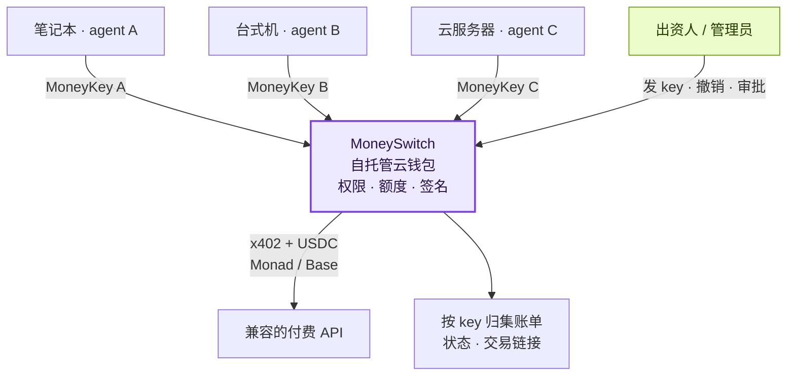

# MoneySwitch

**给 AI bot 用的可编程 Web3 云钱包，部署在你自己的服务器上。**

[官网](https://moneyswitch.dev) · [看产品演示](https://moneyswitch.dev/videos/technical-demo/) · [开始试用](https://moneyswitch.dev/pilot/zh/) · [贡献 PR](https://moneyswitch.dev/contribute/zh/) · [English](README.md)

[](https://moneyswitch.dev)

你的多个 AI agent 分布在笔记本、台式机和云服务器上。给每个 agent 一把有独立支出规则的 **MoneyKey**，统一连接你自托管的云钱包。AI 通过 HTTP API 请求付款，钱包私钥留在服务端。

- **一个 agent 一把 key：** 日额度、总额度、单笔上限、允许的域名、有效期，随时可撤销。
- **人掌握支出权限：** 达到或超过设定审批线的付款等待人工批准；硬性额度限制仍然生效。
- **每笔支出可追溯：** 按 key 查看账单、扣款结果和交易链接，通过 Monad 或 Base 上的 USDC 支付兼容的 x402 服务。

## 先看产品怎么用

点击预览图即可在浏览器观看，无需登录。

<table>
  <tr>
    <td width="50%">
      <a href="https://moneyswitch.dev/videos/technical-demo/"></a>
      <p><a href="https://moneyswitch.dev/videos/technical-demo/"><strong>▶ 产品实录 · 2 分 02 秒</strong></a><br>两把 MoneyKey、直接付款、人工审批后付款、交易记录，以及撤销 key。</p>
    </td>
    <td width="50%">
      <a href="https://moneyswitch.dev/videos/pitch/"></a>
      <p><a href="https://moneyswitch.dev/videos/pitch/"><strong>▶ 为什么要做云钱包 · 1 分 38 秒</strong></a><br>多设备、多 agent 的支出难题、产品方案，以及创作者贺去病 / hecare。</p>
    </td>
  </tr>
</table>

产品实录是在 **Monad 测试网**上的真实 Dashboard 录屏，由两个脚本化 HTTP 客户端完成真实测试网交易；测试 USDC 没有货币价值。两段视频均有英文旁白和字幕。[全部视频](https://moneyswitch.dev/videos/) · [下载 MP4](https://github.com/dongsheng123132/moneyswitch/releases/tag/metropolis-videos-2026-10-09)

## 云钱包怎样连接多个 agent



部署者控制服务和自己的资金，agent 拿到的是受限支出 key。云钱包应与 agent 的操作系统权限隔离，详见[自托管部署指南](deploy/README.zh-CN.md)。

## 真实产品界面

以下是 2026 年 10 月 9 日测试网演示中的 v0.7.6 实际界面，点击图片可查看原图。上方封面是概念插画，下方截图来自正在运行的产品。

**1. 给不同 agent 设置各自的额度和审批规则。**

[](docs/media/dashboard-keys.png)

**2. 达到审批线的付款，等待人来批准。**

[](docs/media/dashboard-approval.png)

**3. 看清哪个 agent 花了多少钱，对应哪笔链上交易。**

[](docs/media/dashboard-bills.png)

## 试用、反馈，也欢迎直接提 PR

| 入口 | 可以做什么 |
| --- | --- |
| [测试网试用指南](https://moneyswitch.dev/pilot/zh/) | 部署自己的实例、创建测试网 key、完成第一笔测试付款。 |
| [提交试用反馈](https://github.com/dongsheng123132/moneyswitch/issues/new?template=early-feedback.yml) | 写下你的使用场景、遇到的问题和改进建议。 |
| [第一次提 PR](https://moneyswitch.dev/contribute/zh/) | 跟着 Fork → 修改 → 验证 → PR 的步骤参与；欢迎文档、接入说明和小范围修复。 |
| [文章、图片和视频素材](https://moneyswitch.dev/media/) | 从官网素材中心获取可分享的 MoneySwitch 介绍。 |

**一台 MoneySwitch 只替一个出钱的人花钱。** 你自己在自己的机器上用、公司给员工的 AI 发 key、公司给自己的 bot 用，都是一个出钱的人：钱包里的钱全是部署者自己的。key 由管理员发，没有注册，没有用户账号。

[SPEC.md](SPEC.md) 是唯一有效的规格。下方是运行方式和支付细节。

## 从代码运行

需要 Node.js 22+ 和 pnpm。

```sh
pnpm install --frozen-lockfile
pnpm build
node apps/server-pkg/dist/cli.js --data-dir ./data
```

首次启动会打印管理员令牌和一条一次性登录链接（30 分钟内有效，只能用一次）。打开链接：自动登录并停在「钱包」页。请把 `MONEYSWITCH_PUBLIC_URL` 设成大家访问这台服务的地址，审批链接和技能说明都用它（不设就是服务自己的监听地址，默认 `http://127.0.0.1:4020`，永远不取请求里的 `Host`）。管理员令牌丢了：在服务器本机、用运行服务的系统用户执行 `moneyswitch-server reset-admin-token`（Docker：`docker compose exec server node /app/dist/cli.js reset-admin-token`；源码：`pnpm admin:reset-token -- --data-dir <目录>`），详见 [docs/security.md](docs/security.md)。

后台只有 4 个页面加登录：

| 页面 | 做什么 |
|---|---|
| **钱包** | 创建钱包，12 个词只显示一次，抄下后勾选「我已抄下」，再转入少量 USDC。重启后自动解锁。余额分「主网 · 真钱」和「测试网 · 测试币，没有价值」两组显示（只显示启用了的），各带各的充值说明。 |
| **Key** | 一个 AI 一把。先选网络类型：**测试网**（测试币，没有价值）或**主网**（真 USDC，必须勾选「这把 key 花真钱」）；测试网 key 只在测试网付款，主网 key 只在主网付款，永不串用。再填日额度、总额度、单笔上限、允许的域名、审批线、过期时间。创建后 key 和技能段落（写明这把 key 是哪一类）只显示一次，把技能段落粘贴给 AI。每把根 key 还有一个给用这把 key 的人的**确认码**：4–6 位数字，你填（可以填他自己想要的），留空则随机生成 4 位；它只显示一次，就在 key 旁边，技能段落里没有它——给人，不给 AI。key 列表里的「设置确认码」随时可以换（同时解锁）；重置密钥不影响它。v0.7.4 之前发的 key 没有确认码，设置之后才有，列表上会标「无确认码 · 只能管理员批」。发出后额度和网络类型都不可改：要改就撤销旧 key、发一把新的；允许的域名只能在审批新域名时放宽（见下）。列表上每把 key 标明测试网 / 主网；v0.7.2 之前发的 key 显示「旧 key」和它实际能付款的链（见「支持的链」一节，建议撤销后重发）。 |
| **审批** | 批准或拒绝超过审批线的付款，或请求了不在某把 key 允许列表里的域名：批准新域名就是把它加进这把 key 的允许域名。管理员在这里看到并能处理全部；持这把 key 的人不用登录：审批链接直接打开，只看到这一条，输入这把 key 的确认码就能批准或拒绝。 |
| **账单** | 每一笔：时间、key、金额、网址、链（标明主网 / 测试网）、交易号、扣款状态（yes / no / maybe）。合计按主网、测试网分开，真钱和测试币从不相加；可按主网 / 测试网筛选；CSV 末尾多一列 `network_kind`。 |

AI 用 `POST /v1/fetch` 付款。超过审批线时返回 `approval_required`，带 `approval_id` 和 `approve_url`（`{MONEYSWITCH_PUBLIC_URL}/approvals?id=…`）。技能让 AI 把链接发给给它这把 key 的人，并每 15 秒查一次 `GET /v1/approvals/:id`。链接本身不含令牌，也不用登录：打开就看到这一条（网站或金额、链、哪把 key），输入这把 key 的确认码即可批准或拒绝。确认码是根 key 的（子 key 没有自己的），自上次设置以来累计输错 5 次就锁住（输对一次不清零），直到你设置新的确认码；太好猜的确认码（1111、1234、4321、2580 这类）设置时就会被拒绝；你登录后始终可以批。key 本身永远不能批准：AI 拿着它，却没有确认码。批准后 AI 带 `approval_id` 原样重发。请求的 http(s) 域名不在这把 key 的允许列表里时，同样先返回 `approval_required`，此时还没有向该域名发出任何请求。批准就是把这个 `host:port` 永久加进这把 key 的允许域名，之后 AI 原样重发即可，不用带 `approval_id`；价格仍照常检查，超过审批线会再问一次。批准时会查一次域名：解析到私有地址（或本机自己的地址）、或解析失败 / 超时的会被拒绝，审批保持待批。子 key、非 http(s)、以及私有 / 本机 / 特殊用途地址的字面地址直接返回 `HOST_NOT_ALLOWED`；每把 key 最多 5 条待批的新域名（超过返回 `RATE_LIMITED`）。审批 10 分钟过期。不做推送渠道。

公开的 `GET /skill.md` 是不含 key 的通用说明。接入方式只有「技能 + key」，另外就是直接调用 HTTP 接口。

### 测试网上的第一笔

实例启用了 Monad 测试网时（同时启用了主网也没关系），**测试网 key** 的表单有「允许测试付款接口」（默认勾选，会把 `app.moneyswitch.dev:443` 加进允许域名）；主网 key 永远不提供。技能随后会让 AI 向 `https://app.moneyswitch.dev/x402-testnet/check` 付一笔测试款，并报告交易号。这个接口是 Monad 测试网上的测试收款端，钱没有价值。

## 自己的服务器

[部署说明](deploy/README.zh-CN.md)：Docker Compose、HTTPS/Caddy、持久数据卷、健康检查、备份和回滚。**不要把服务和 AI 放在同一台机器、同一个系统用户下**：AI 能直接改数据库、绕过额度。同一个 SQLite 数据卷只运行一个写入实例。出站请求按 `MONEYSWITCH_PROXY`（`off`、`auto` 或代理地址）、`HTTPS_PROXY` / `HTTP_PROXY` / `ALL_PROXY`、Windows 系统代理的顺序选代理。

## 支持的链与付款结果

| 网络 | CAIP-2 |
|---|---|
| Monad 测试网 | eip155:10143 |
| Base Sepolia | eip155:84532 |
| Monad 主网 | eip155:143 |
| Base 主网 | eip155:8453 |

默认只开测试网：`MONEYSWITCH_NETWORKS` 给出允许列表，`MONEYSWITCH_DEFAULT_NETWORK` 必须在其中；启用主网就是真实 USDC。每条链只认自己的 USDC，同一地址在各链的余额独立。不换币、不跨链。只签 EIP-3009，不签 Permit2。

主网和测试网可以在同一台服务器、同一个钱包上同时启用（先在测试网跑通，再花一点真钱）。每把 key 要么是测试网 key、要么是主网 key（`network_mode`：`testnet` | `mainnet`），发 key 时选定，之后不能改；它只在启用的、自己这一类的链里付款，选链顺序按 `MONEYSWITCH_NETWORKS`。`POST /v1/keys` 不给 `network_mode` 时：实例只开了一类就用那一类，两类都开返回 `400 NETWORK_MODE_REQUIRED`。卖家只接受另一类链时返回 `UNSUPPORTED_PAYMENT`（`charged: no`，什么都没签）。子 key 与父 key 同类。v0.7.2 之前发的 key 没有类型（`network_mode: null`）：实例只开一类时保持原样（那一类的所有链）；**两类都开时只在测试网付款**（加开主网不会让旧 key 花到真钱）。没有类型的 key 在有类型的父 key 之下，跟随父 key；同一条链上两级类型不同，这把 key 哪条链都不能付（`UNSUPPORTED_PAYMENT`）。

每次 `/v1/fetch` 的返回都带 `charged: yes | no | maybe`。已签名但结果不明的付款是 `payment_unknown`，**AI 不得自动重试**；服务稍后到链上对账并补上交易号。

## 不做什么

永远不做：法币出入金、换币、跨链桥、发币、收款 / 卖方功能、替别人保管钱——包括开放注册、每个用户一份余额、充值 / 提现、兑换码、加价转售。让陌生人存钱、再通过 key 花出去，在钱这边不叫中转，叫托管：多数地方需要牌照，有的地方明令禁止。MoneySwitch 是自托管软件，只花部署者自己的钱；谁拿它替别人保管或代付，法律责任由谁承担。增加注册、余额、充值或支付集成的 PR 会被关闭。现在不做：员工门户界面、推送渠道、模型网关、MCP、命令行客户端、本机启动器、桌面壳、导入钱包、外部钱包。子 key 的后端逻辑保留，没有界面。数据库里的旧表保留。详见 [SPEC.md](SPEC.md) §8。

## 验证与许可

```sh
pnpm test
pnpm test:e2e
node scripts/deploy-smoke.mjs   # 在一次性目录里验收已构建的包
```

离线测试使用真实签名和模拟结算，不代表真实链上付款；部署验收另核对 HTTPS、持久化、重启和备份。每个对外接口都登记在 `apps/server/test/unit/route-inventory.test.ts`。

服务端、核心和 Dashboard：AGPL-3.0-only；`apps/demo-seller` 和 `apps/qwen-agent`：Apache-2.0（`apps/qwen-agent` 原样保留、不维护）。详见各包 LICENSE。
